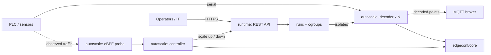

# ot-edge-runtime

[](https://github.com/http418imateapot/ot-edge-runtime/actions/workflows/ci.yml)
[](LICENSE)

**A container runtime and supervision toolkit for OT edge workloads on industrial single-board computers.**

繁體中文版本請見 [README.zh-TW.md](README.zh-TW.md)。

---

## The problem

On an industrial single-board computer sitting next to a PLC, there is an
awkward gap in the tooling:

- **K3s, KubeEdge and friends are too heavy.** A cluster control plane, an
  embedded datastore and a CNI are a lot of resident memory and a lot of moving
  parts for a box whose job is to decode serial-port data and forward it to
  MQTT. They also assume a network and a lifecycle that a plant floor rarely
  provides.
- **Bare `systemd` is too little.** It will start your process and restart it
  when it dies, but it gives you no orchestration story, no image lifecycle, no
  API to drive from an operator tool, and — in practice — no enforced resource
  ceiling between the workload that must never stall and the workload that
  occasionally goes haywire.

`ot-edge-runtime` fills that gap with four small, independently deployable
components: use `runc` and cgroups directly for isolation, drive them over an
authenticated REST API, scale the data-path workload from kernel-level traffic
signals, and keep configuration on a store that survives an abrupt power cut.

## What is inside

| Directory | Language | What it does |
|-----------|----------|--------------|
| [`runtime/`](runtime/) | Python | Authenticated REST API for managing Linux-native `runc` containers and their cgroup limits. |
| [`autoscale/`](autoscale/) | Python | eBPF monitor of PLC serial-port ingress, plus a controller that scales MQTT decoder instances and subscription strategy. |
| [`edgeconf/core/`](edgeconf/core/) | C | Embedded binary key-value configuration engine — between "SQLite is too heavy" and "a text file is too fragile". |
| [`edgeconf/patterns/`](edgeconf/patterns/) | C | Fault-tolerant reference patterns for POSIX processes exchanging messages through configuration files (D-Bus / ubus back-ends). |

Full documentation for each component lives in [`docs/`](docs/).

## Architecture



See [`docs/architecture.md`](docs/architecture.md) for the full component map,
how the four pieces compose, and the explicit non-goals.

## Quick start

Each component still builds and installs on its own terms; there is no unified
build yet. All of them target Linux — `runtime/` needs `runc`, `autoscale/`
needs a kernel with eBPF and the BCC Python bindings, and the `edgeconf/`
components are POSIX C.

```bash
git clone https://github.com/http418imateapot/ot-edge-runtime.git
cd ot-edge-runtime
```

**`runtime/` — container management API**

```bash
sudo apt-get install -y runc cgroup-tools
python -m venv .venv && . .venv/bin/activate
cd runtime
pip install -e ".[dev]"
python -m pytest
```

**`autoscale/` — PLC traffic autoscaler**

```bash
# BCC comes from the system package manager, not from pip
sudo apt-get install -y python3-bpfcc
cd autoscale
pip install -e ".[dev]"
python -m pytest
```

**`edgeconf/core/` — configuration engine**

```bash
make -C edgeconf/core        # wraps CMake; builds librobustcfg + robust_cfg_tool
make -C edgeconf/core test   # ctest
```

**`edgeconf/patterns/` — config-exchange reference**

```bash
sudo apt-get install -y libdbus-1-dev
make -C edgeconf/patterns                    # default D-Bus back-end
make -C edgeconf/patterns IPC_BACKEND=ubus   # OpenWrt / ubus back-end
```

## How the components relate

They were built separately and each one still stands alone. The intended
composition is:

1. `runtime/` provides the isolation boundary and the resource ceiling, so a
   runaway decoder cannot starve the acquisition path.
2. `autoscale/` decides *how many* decoders should exist, based on traffic
   observed in the kernel rather than polled from userspace, and asks the
   runtime to make it so.
3. `edgeconf/core/` holds the settings and thresholds both of them depend on, on
   flash media that will lose power without warning.
4. `edgeconf/patterns/` documents the fault-tolerant config-file exchange
   patterns that `edgeconf/core/` grew out of, and remains useful on its own for
   POSIX applications that already use a config file as their message channel.

Adopting one component does not require adopting the others.

## Limitations

- **Not an orchestrator.** Single node only. No scheduler, no cluster
  membership, no overlay networking, no image registry.
- **Not safety-rated.** Nothing here is certified against IEC 62443, IEC 61508
  or ISO 13849. Apache-2.0 grants no warranty and no indemnity; validating a
  deployment remains the integrator's responsibility.
- **Linux only**, and in places kernel-version sensitive — the eBPF probe in
  `autoscale/` in particular.
- **Not yet a unified project.** The merge preserved four independent builds,
  test suites and version numbers. There is no shared release train and no
  cross-component integration test; the repository-wide workflow in
  `.github/workflows/ci.yml` simply drives each component's own build. The
  per-component CI workflows inherited from the source repositories are kept
  under each component's `.github/` directory, where GitHub does not execute
  them.

## History and provenance

This repository was assembled from four previously separate projects, with their
full commit histories preserved rather than squashed:

| Directory | Source repository | Commits carried over |
|-----------|-------------------|----------------------|
| `runtime/` | `runc-edge-api` | 17 |
| `autoscale/` | `plc-ebpf-autoscaler` | 23 |
| `edgeconf/core/` | `robust-binary-config` | 20 |
| `edgeconf/patterns/` | `robust-config-exchange` | 8 |

`git log -- runtime/` (and equivalently for the other directories) reaches back
to the original project's first commit. [`docs/migration-report.md`](docs/migration-report.md)
records exactly how the merge was done and every change that was applied.

## License

Apache License 2.0 — see [`LICENSE`](LICENSE).

The four source projects were originally released under the MIT License by the
same copyright holder. Their original copyright notices are retained in
[`NOTICE`](NOTICE), as the MIT terms require.
