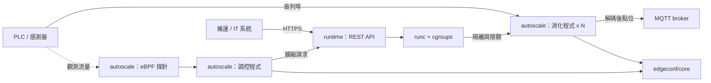

# ot-edge-runtime

[](https://github.com/http418imateapot/ot-edge-runtime/actions/workflows/ci.yml)
[](LICENSE)

**工業單板電腦 (SBC) 上的 OT 邊緣工作負載容器執行與監管工具組。**

English version: [README.md](README.md)

---

## 問題定義

在緊鄰 PLC 的工業單板電腦上，現有工具存在一段尷尬的空隙：

- **K3s、KubeEdge 這類方案太重。** 對一台工作內容只是「解碼串列埠資料、轉送到
  MQTT」的機器而言，叢集控制平面、內嵌資料庫與 CNI 佔用的常駐記憶體與可動零件
  都過多；它們預設的網路環境與生命週期，也不是廠區現場能提供的。
- **裸 systemd 又太少。** 它能啟動行程、能在崩潰後重啟，但沒有編排概念、沒有
  映像檔生命週期、沒有可供維運工具驅動的 API；實務上更沒有在「絕不能卡住的工作
  負載」與「偶爾失控的工作負載」之間強制隔離資源的能力。

`ot-edge-runtime` 以四個可獨立部署的小型元件填補這段空隙：直接使用 `runc` 與
cgroups 做隔離、以帶認證的 REST API 驅動、依核心層流量訊號調整資料路徑的實例
數量，並把設定放在能承受突然斷電的儲存引擎上。

## 工廠情境

本工具組源自四個廠區現場的實際情境。每個情境的完整說明——症狀、為何常見作法不合用、本專案改用什麼方式，以及操作範例——收錄於 [`docs/scenarios.zh-TW.md`](docs/scenarios.zh-TW.md)。

| 情境 | 實際出的問題 | 對應元件 |
|------|--------------|----------|
| 高頻量測時採集端塞車 | 串列埠緩衝區塞滿、點位遺失。它在 historian 上只呈現為資料空隙而非告警，且只在最快的配方下發生。 | [`autoscale/`](autoscale/) |
| 某個工作負載餓死了真正重要的那個 | 上傳程式的重試風暴吃光 CPU 與記憶體，直到採集路徑錯過時限。沒有程式崩潰，所以沒有告警。 | [`runtime/`](runtime/) |
| 寫入設定時遇上斷電 | 機器開回來時設定檔被截斷——或更糟，用一份解析到一半的設定啟動，以微妙錯誤的方式運作。 | [`edgeconf/core/`](edgeconf/core/) |
| 新設定必須立刻生效且不能重啟 | 為了一個數字重啟五個程式，代表採集在生產中出現空隙。 | [`edgeconf/patterns/`](edgeconf/patterns/) |

## 內容組成

| 目錄 | 語言 | 職責 |
|------|------|------|
| [`runtime/`](runtime/) | Python | 管理 Linux 原生 `runc` 容器與其 cgroup 限制的認證 REST API。 |
| [`autoscale/`](autoscale/) | Python | 以 eBPF 監控 PLC 串列埠採集流量，並動態調整 MQTT 消化程式實例數與訂閱策略。 |
| [`edgeconf/core/`](edgeconf/core/) | C | 嵌入式二進位 Key-Value 設定引擎——填補「SQLite 太重、純文字檔太脆」之間的空隙。 |
| [`edgeconf/patterns/`](edgeconf/patterns/) | C | 讓多個 POSIX 程式安全共享設定檔的同步常駐程式：原子寫入、跨程序互斥鎖，以及走可抽換傳輸層的 inotify delta 廣播。 |

各元件的完整文件位於 [`docs/`](docs/)。

## 架構



完整元件圖、組合方式與明確的非目標，請見
[`docs/architecture.md`](docs/architecture.md)。

## 快速開始

四個元件目前仍各自建置、各自安裝，尚未整合為單一建置流程。全部以 Linux 為目標
平台：`runtime/` 需要 `runc`，`autoscale/` 需要支援 eBPF 的核心與 BCC Python
綁定，`edgeconf/` 兩個元件則是 POSIX C。

```bash
git clone https://github.com/http418imateapot/ot-edge-runtime.git
cd ot-edge-runtime
```

**`runtime/` — 容器管理 API**

```bash
sudo apt-get install -y runc cgroup-tools
python -m venv .venv && . .venv/bin/activate
cd runtime
pip install -e ".[dev]"
python -m pytest
```

**`autoscale/` — PLC 流量自動調控**

```bash
# BCC 由系統套件管理器提供，不經由 pip 安裝
sudo apt-get install -y python3-bpfcc
cd autoscale
pip install -e ".[dev]"
python -m pytest
```

**`edgeconf/core/` — 設定引擎**

```bash
make -C edgeconf/core        # 包裝 CMake，建置 librobustcfg 與 robust_cfg_tool
make -C edgeconf/core test   # ctest
```

**`edgeconf/patterns/` — 設定交換範例**

```bash
sudo apt-get install -y libdbus-1-dev
make -C edgeconf/patterns        # 以 D-Bus adapter 建置（預設）
make -C edgeconf/patterns test   # 單元測試，不需任何 bus
```

## 四元件的關係

四者原本各自獨立開發，現在也仍可各自單獨使用。建議的組合方式為：

1. `runtime/` 提供隔離邊界與資源上限，使失控的消化程式不會餓死採集路徑。
2. `autoscale/` 依據核心層觀測到的流量（而非使用者空間輪詢）決定該有幾個消化
   程式實例，並請求 runtime 執行擴縮。
3. `edgeconf/core/` 保存前兩者所依賴的設定與門檻值，並確保在會無預警斷電的
   快閃儲存媒體上不致毀損。
4. `edgeconf/patterns/` 把設定的變更同時分發給每一個程式，不需重啟；而且走的是
   可抽換的傳輸層，因此同一支常駐程式既適用 D-Bus 發行版，也適用 OpenWrt/uClinux 裝置。

採用其中一個元件，並不強制採用其餘三個。

## 限制

- **不是編排器。** 僅支援單一節點，沒有排程器、叢集成員管理、overlay 網路或
  映像檔 registry。
- **未取得安全認證。** 本專案未通過 IEC 62443、IEC 61508 或 ISO 13849 認證。
  MIT License 不提供保固與賠償，導入驗證仍屬系統整合方的責任。
- **僅支援 Linux**，且部分功能對核心版本敏感——尤其是 `autoscale/` 的 eBPF 探針。
- **尚未整合為單一專案。** 本次合併保留了四套獨立的建置、測試與版本編號，沒有
  共用的發版流程，也沒有跨元件整合測試；根目錄的 `.github/workflows/ci.yml`
  僅是分別驅動各元件既有的建置方式。原始 repo 的 CI workflow 保留在各元件的
  `.github/` 目錄下，GitHub 不會在該位置執行它們。

## 沿革與來源

本 repo 由四個原本獨立的專案合併而成，完整保留（未 squash）各自的 commit 歷史：

| 目錄 | 來源 repo | 帶入的 commit 數 |
|------|-----------|------------------|
| `runtime/` | `runc-edge-api` | 17 |
| `autoscale/` | `plc-ebpf-autoscaler` | 23 |
| `edgeconf/core/` | `robust-binary-config` | 20 |
| `edgeconf/patterns/` | `robust-config-exchange` | 8 |

執行 `git log -- runtime/`（其餘目錄同理）可一路追溯到原專案的第一個 commit。
合併方式與所有實際變更，記錄於
[`docs/migration-report.md`](docs/migration-report.md)。

## 授權

MIT License——詳見 [`LICENSE`](LICENSE)。
