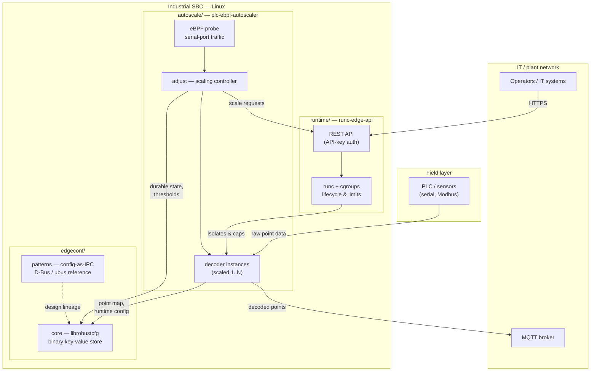

# Architecture overview

`ot-edge-runtime` bundles four components that were developed separately but
solve adjacent parts of the same problem: running and supervising OT workloads
on an industrial single-board computer, where K3s/KubeEdge is too heavy and bare
`systemd` gives no orchestration or resource isolation.

## Component map

## What each component owns

| Path | Origin | Language | Responsibility |
|------|--------|----------|----------------|
| [`runtime/`](../runtime/) | `runc-edge-api` | Python | Container lifecycle on top of `runc` and cgroups, exposed as an authenticated REST API. Provides the isolation and resource ceiling that the other workloads run inside. |
| [`autoscale/`](../autoscale/) | `plc-ebpf-autoscaler` | Python | Kernel-level (eBPF) observation of PLC acquisition traffic, and a controller that scales decoder instances and MQTT subscription strategy when the pipeline congests. |
| [`edgeconf/core/`](../edgeconf/core/) | `robust-binary-config` | C | Crash-tolerant binary key-value configuration store — the persistence substrate for settings that must survive power loss on flash media. |
| [`edgeconf/patterns/`](../edgeconf/patterns/) | `robust-config-exchange` | C | Reference implementations for POSIX processes that exchange messages through configuration files, with D-Bus and ubus notification back-ends. |

## How they compose

1. **Isolation first.** `runtime/` wraps each OT workload in a `runc` container
   with explicit cgroup limits, so a misbehaving decoder cannot starve the
   acquisition path. Control is exposed over an authenticated REST API rather
   than a cluster control plane.
2. **Elasticity from kernel signals.** `autoscale/` observes the serial-port
   ingress with eBPF instead of polling userspace counters, and reacts by asking
   the runtime for more (or fewer) decoder instances and by adjusting MQTT
   subscription strategy.
3. **State that survives power loss.** Both Python components need settings and
   thresholds that stay intact across the abrupt power cuts typical of a factory
   floor. `edgeconf/core/` provides that store; `edgeconf/patterns/` documents
   the fault-tolerant exchange patterns the store's design grew out of.

## Deliberate non-goals

- Not a Kubernetes distribution, and not a replacement for one. There is no
  scheduler, no multi-node membership, and no cluster networking.
- Not a safety-instrumented system. Nothing here is certified for IEC 62443,
  IEC 61508 or ISO 13849, and the MIT License grants no warranty.
- Components are **independently deployable**: nothing forces you to adopt all
  four. The coupling shown above is a recommended composition, not a hard
  dependency.

## Current integration status

The four components were merged into this repository with their histories
intact, but they have **not** been re-plumbed into a single build or a single
release train. Each component still builds, tests and installs on its own terms
— see the component documents linked in the table above, and
[`migration-report.md`](migration-report.md) for exactly what was and was not
changed during the merge.
